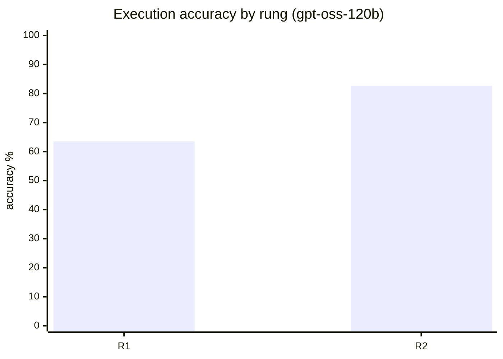

# Evaluation report

Golden set: 52 answerable questions + 6 that must be refused (`evals/golden.yml`, fingerprint `9668746c7a85`). Execution accuracy compares the agent's result set with the reference query's (see `evals/compare.py` for the rules). Refusal questions are scored separately and excluded from accuracy.

> **Coverage rule.** A (model, rung) cell is reported only when at least 90% of the answerable questions were scored (100% for R5, whose skips are never random). Cells below the threshold are left out rather than estimated:
>
> - gemini-flash R1: 9/52 answerable questions scored (excluded)
> - gpt-oss-120b R3: 8/52 answerable questions scored (excluded)
> - gpt-oss-20b R5: 51/52 answerable questions scored (excluded)

## Ablation ladder: gpt-oss-120b

`groq/openai/gpt-oss-120b` · git `c781869` · 2026-09-27T12:34:18+00:00

| Rung | Execution accuracy | 95% CI | Valid SQL | Refusals correct | Repaired | Tokens in/out per q | p50 / p95 latency |
|---|---|---|---|---|---|---|---|
| R1 L1 raw DDL | **63.5%** (33/52) | 49.9%–75.2% | 100.0% | 6/6 | 0 | 933 / 255 | 1.2s / 3.0s |
| R2 L2 + dbt docs | **82.7%** (43/52) | 70.3%–90.6% | 96.2% | 6/6 | 0 | 2,482 / 259 | 1.3s / 2.5s |

What each rung changed (questions fixed / broken versus the previous rung):

- R1 → R2 (L2 + dbt docs): +11 fixed, −1 broken

### By question tag

| Tag | n | R1 | R2 |
|---|---|---|---|
| join | 2 | 50.0% | 100.0% |
| metric | 25 | 48.0% | 68.0% |
| pitfall | 12 | 75.0% | 75.0% |
| ranking | 11 | 72.7% | 90.9% |
| stats | 1 | 100.0% | 100.0% |
| time | 24 | 50.0% | 75.0% |
| values | 17 | 52.9% | 88.2% |
| window | 2 | 0.0% | 50.0% |

### By difficulty

| Difficulty | n | R1 | R2 |
|---|---|---|---|
| easy | 16 | 68.8% | 87.5% |
| medium | 25 | 64.0% | 84.0% |
| hard | 11 | 54.5% | 72.7% |

## Model leaderboard

| Model | Rung | Execution accuracy | 95% CI | Refusals correct | Tokens in/out per q | p50 latency |
|---|---|---|---|---|---|---|
| gpt-oss-20b (`groq/openai/gpt-oss-20b`) | R4 | **98.0%** (50/51) | 89.7%–99.7% | 0/0 | 4,892 / 317 | 1.3s |
| gpt-oss-120b (`groq/openai/gpt-oss-120b`) | R2 | **82.7%** (43/52) | 70.3%–90.6% | 6/6 | 2,482 / 259 | 1.3s |
| qwen3-27b (`groq/qwen/qwen3.8-27b`) | R2 | **82.7%** (43/52) | 70.3%–90.6% | 4/4 | 2,609 / 69 | 0.7s |
| qwen3-27b (`groq/qwen/qwen3.8-27b`) | R1 | **73.1%** (38/52) | 59.7%–83.2% | 4/6 | 1,000 / 68 | 0.5s |
| gpt-oss-120b (`groq/openai/gpt-oss-120b`) | R1 | **63.5%** (33/52) | 49.9%–75.2% | 6/6 | 933 / 255 | 1.2s |
| gpt-oss-20b (`groq/openai/gpt-oss-20b`) | R1 | **63.5%** (33/52) | 49.9%–75.2% | 4/6 | 933 / 283 | 0.8s |

## Remaining failures (gpt-oss-120b, R2)

| Question | Tags | Reason |
|---|---|---|
| `g_revenue_2017` | metric, pitfall, time | no column matches gold 'revenue' (6108492.27) |
| `g_aov_2018` | metric, pitfall, time | no column matches gold 'aov' (137.13633733094224) |
| `g_active_sellers_2018` | metric, time | no column matches gold 'sellers' (2383) |
| `g_early_delivery_share` | pitfall | query error: Binder Error: Referenced column "delivered_to_customer_at" was not found because the FROM clause is missing LINE 13: |
| `g_southeast_revenue` | metric, values | no column matches gold 'revenue' (8822530.97) |
| `g_five_star_revenue_2018` | metric, time | no column matches gold 'revenue' (4164642.43) |
| `g_mom_growth_2018` | metric, time, window | query error: Catalog Error: Scalar Function with name to_char does not exist! Did you mean "to_hours"? LINE 4: TO_CHAR(purch |
| `g_aov_top5_states` | metric, ranking | no column matches gold 'aov' (135.83846277342965, 137.07952372161714, 142.66998109938572, ...) |
| `g_credit_card_revenue_share_2018` | metric, values, time | no column matches gold 'share' (0.7946380438733711) |
